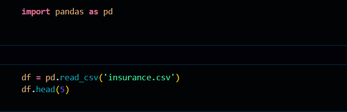
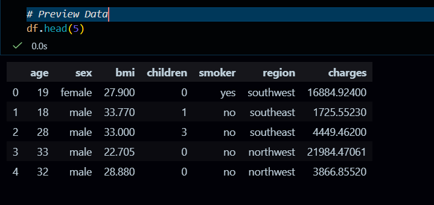
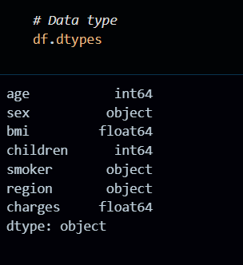
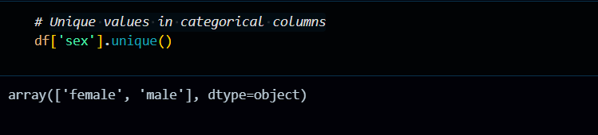

# VAUTECH IT SOLUTIONS – TASK 2

**Intern:** Ansh Verma

**Intern ID:** VT26DS001

**Domain:** Data Science

**Company:** VAUTECH IT SOLUTIONS

**Mentor:** Vishal Rajbhar

## Overview

This task focuses on cleaning the dataset and improving its quality by handling missing and incorrect values, removing duplicates and irrelevant columns, and creating new derived features. The goal is to prepare a clean and reliable dataset that can be used for accurate analysis and further modeling.

## Objectives

To clean the dataset and enhance its features by handling missing and incorrect values, removing duplicates, and preparing the data for reliable analysis.

## Tools Used

- Python
- Pandas
- Jupyter Notebook / VS Code

## Workflow

- Dataset: insurance
- format: CSV
- Source:https://github.com/MainakRepositor/Datasets/blob/master/insurance.csv

## Step 1: Loading the Dataset

- import pandas as pd df = pd.read_csv('insurance.csv')
  

## Step 2: Preview Data

## Step 3: Check missing values

## Step 4: Data type

## Step 5: Unique values in categorical columns

## Step 6: Column - wise completeness

## Conclusion

This task helped in cleaning and improving the dataset by handling missing values, duplicates, and inconsistencies.

The final dataset is now well-structured, reliable, and ready for further analysis or modeling.
